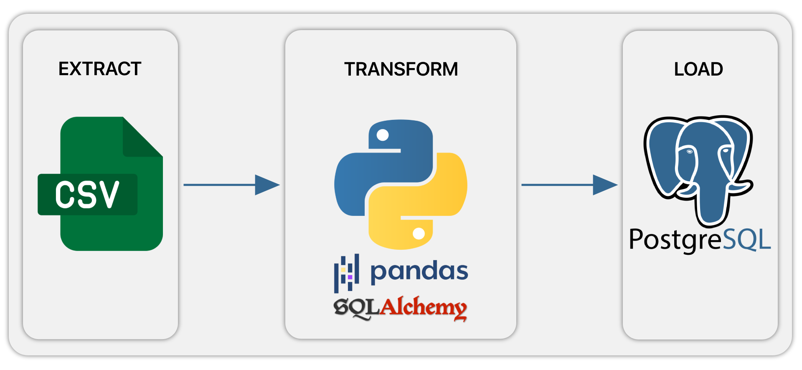

# 📦 Projeto ETL com Python, Pandas e PostgreSQL



Este projeto implementa um pipeline de ETL (Extract, Transform, Load) simples e eficaz utilizando Python, a biblioteca Pandas e o banco de dados PostgreSQL. O objetivo é ler múltiplos arquivos CSV, transformá-los em DataFrames e carregá-los como tabelas no banco de dados, substituindo qualquer tabela existente.

---

## 🚀 Tecnologias Utilizadas

- **Python 3.10+**
- **Pandas**
- **SQLAlchemy**
- **PostgreSQL**
- **psycopg2**

---

## 📌 Funcionalidades

- 🔄 Leitura automática de múltiplos arquivos `.csv`
- 🛠 Transformação (simples) usando `pandas`
- 🐘 Carga de dados no banco PostgreSQL
- 📂 Substituição das tabelas caso já existam
- ✅ Projeto pronto para expandir com tratamento de erros e validações

---

## 📁 Estrutura de Pastas

```
├── csv_files/
│   ├── itens_pedido.csv
│   └── pedidos.csv
├── etl_script.py
├── assets/
│   └── etl_pipeline.png
│   └── e_shop_DER.png
├── ddl_database/
│   └── ddl.sql
├── README.md
```

---

## ⚙️ Como Executar

### 1. Clone o repositório
```bash
git clone https://github.com/DilleyAndrade/ETL-com-Python-Pandas-e-PostgreSQL.git
cd ETL-com-Python-Pandas-e-PostgreSQL
```

### 2. Crie um ambiente virtual (opcional, mas recomendado)
```bash
python -m venv venv
source venv/bin/activate  # Linux/macOS
venv\Scripts\activate     # Windows
```

### 3. Instale as dependências
```bash
pip install -r requirements.txt
```

**Ou instale manualmente:**
```bash
pip install pandas sqlalchemy psycopg2-binary
```

### 4. Configure seu banco de dados

Certifique-se de que seu banco PostgreSQL esteja ativo e configurado com:
- host: `seu localhost`
- port: `sua porta`
- user: `seu usuário`
- password: `sua senha`
- database: `seu banco de dados`

Você pode modificar essas configurações diretamente no `etl_script.py`.

### 5. Execute o script
```bash
python etl_script.py
```

---

## 🧪 Exemplo de Código Principal

```python
files_list = ['itens_pedido', 'pedidos']

def etl_data():
    for file in files_list:
        df = pd.read_csv(f"csv_files/{file}.csv")
        df.to_sql(f'{file}', con=engine, schema='public', if_exists='replace', index=False)
        print(f'Table {file} saved!')

etl_data()
```

---

## 📈 Pipeline do Projeto

A imagem abaixo representa o pipeline ETL deste projeto:

```
[CSV Files] → [Transformações com Pandas] → [Carga no PostgreSQL]
```

> 

---

## 🔒 Segurança

> ⚠️ **Evite hardcoding de credenciais em produção!**
- Utilize variáveis de ambiente (`os.environ`) ou bibliotecas como `python-dotenv`.

---

## 📌 Possíveis Expansões

- Validação de schema dos arquivos
- Logging detalhado
- Testes automatizados com `pytest`
- Interface CLI com `argparse` ou `click`
- Dashboard simples com `Streamlit` ou `Flask`

---

## 👨‍💻 Autor

Dilley Andrade
Engenheiro de Dados | SQL | ETL | Python — Focado em soluções de dados, ETL, BI e engenharia de dados.
(81) 98663-2609 | dilleyandrade@gmail.com |
http://linkedin.com/in/dilleyandrade | http://github.com/DilleyAndrade 

---

## 📄 Licença

Este projeto está sob a licença MIT. Consulte o arquivo `LICENSE` para mais detalhes.
